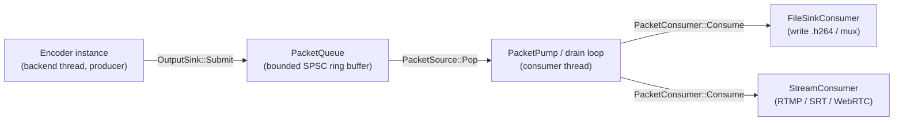
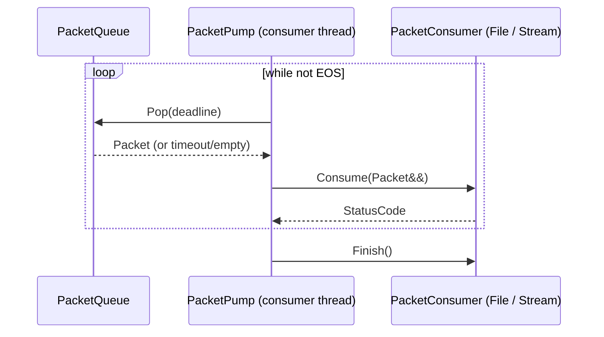

# Output Transport: Ring Buffer + Consumer

How encoded output flows from the encoder to a consumer (file writer **or** network
streamer) through a bounded ring buffer. This design is **transport-first**: the ring
buffer and the consumer interface are specified now so that a file sink and a streamer
can both be implemented later against the same contract without touching the encoder.

## Big picture



The encoder never knows who consumes its packets. It pushes to an `OutputSink`; a drain
loop pops from the `PacketSource` and forwards each packet to a `PacketConsumer`.
Swapping file output for streaming is a one-line change of the `PacketConsumer`
implementation.

## 1. Producer side — encoder → ring buffer

The encoder, after a successful `Encode()`, forwards the packet to a configured
`OutputSink`. The pull API (`Encode()` returning `Result<Packet>`) is unchanged;
pushing is an **optional** sink mode (see `contracts/output-queue-contract.md`).

`PacketQueue` implements `OutputSink` (producer endpoint). Packets are **moved**
into pre-allocated slots — no per-packet heap allocation on the encode hot path.

## 2. The ring buffer (`PacketQueue`)

- Bounded, fixed `capacity` (power of two) chosen at construction.
- Single producer (encoder), single consumer (drain loop) → **SPSC** over a slot array.
- Packets are a **unified `Packet`** (video/audio distinguished by `PacketType`), but stored
  on **two independent rings** — one per media — so back-pressure and drain are per-media:
  a stall on video does not block audio and vice versa. `Submit` routes by `pkt.type`;
  `Pop` alternates round-robin so neither media starves.
- Back-pressure when full (configurable):
  - `kBlock` (default): `Submit` waits — natural flow control; a slow consumer slows the
    encoder instead of dropping frames.
  - `kDropOldest`: overwrites the oldest unconsumed slot (lossy, for real-time).
  - `kError`: returns a back-pressure `StatusCode` (strict pipelines).

Design note: SPSC is the correct shape because there is exactly one encoder thread and
one drain thread. An MPMC queue would be more general but harder to make wait-free and
unnecessary here. See ADR-005.

## 3. Consumer side — drain loop → PacketConsumer



### PacketConsumer (interface)

```cpp
class PacketConsumer {
  public:
    virtual ~PacketConsumer() = default;
    // One Consume for both media; the packet's PacketType tells the consumer
    // which media it is. Media-specific consumers return kUnsupportedOperation
    // for the other.
    virtual StatusCode Consume(Packet&& pkt) = 0;
    virtual StatusCode Flush() { return StatusCode::kOk; }
    virtual StatusCode Finish() { return StatusCode::kOk; } // EOS / cleanup
};
```

### PacketPump (drain loop)

Runs on the consumer thread; bridges `PacketSource` → `PacketConsumer`. It is the
pump that moves encoded packets out of the ring buffer and into a transport consumer
(file / stream). Reference: `codec/src/framework/consumer/packet_pump.cc`.

```cpp
void PacketPump::Run(PacketSource& src, PacketConsumer& c,
                     int64_t deadline_us = 100'000) {
  Packet pkt;
  while (true) {
    switch (src.Pop(pkt, deadline_us)) {
      case PopResult::kOk:
        if (c.Consume(std::move(pkt)) != StatusCode::kOk) { c.Finish(); return; }
        break;
      case PopResult::kEos:
        c.Finish();  // queue drained -> flush + close the consumer
        return;
      case PopResult::kEmpty:
        break;  // retry (deadline expired, not yet EOS)
    }
  }
}
```

Behavior:

- **Blocking drain**: `Pop(deadline)` (default 100 ms) blocks instead of busy-spinning when
  the queue is momentarily empty (`kEmpty` → retry next iteration).
- **Video + audio**: both travel as `Packet`; `PacketQueue::Pop` drains them round-robin
  from the two internal rings, so neither media starves and a video-only or audio-only
  queue still ends in a clean `Finish()`.
- **EOS handling**: `Pop` returns `kEos` once the queue is marked end-of-stream and both
  rings are fully drained; the pump then calls `PacketConsumer::Finish()` (e.g.
  `FileSinkConsumer` flushes and closes the file).
- **Failure safety**: a failing `Consume` is logged, `Finish()` is called once, and the pump
  stops — it must NOT swallow errors and spin.
- **Decoupling**: the pump runs on the consumer thread while the encoder pushes on its own
  thread; a slow consumer back-pressures the queue (`kBlock`), which naturally slows the
  encoder (end-to-end flow control).

## 4. Concrete consumers (implement later, design now)

The architecture fixes the `PacketConsumer` contract; the two target consumers are:

### 4.1 FileSinkConsumer

- Writes the raw Annex-B bitstream to a file (`.h264` / `.aac`), **or** feeds a muxer to
  produce `.mp4` / `.mkv` (container muxing is deferred per `project_bootstrap.md`, but
  the muxer is just another `PacketConsumer` implementation behind the same interface).
- Must preserve packet order and `keyframe` boundaries; emit SPS/PPS at the start and on
  config change (the encoder already tags these).
- Uses `pts_us` for optional interleaving when both video + audio consumers write one
  file (or two files).

### 4.2 StreamConsumer (推流 / network push)

- Pushes packets to a network endpoint: **RTMP**, **SRT**, or **WebRTC** (actual protocol
  client deferred per `project_bootstrap.md`; the contract is defined now).
- Responsibilities the design must anticipate:
  - **Framing**: Annex-B must be chunked into protocol units (FLV tags for RTMP, RTP for
    WebRTC/SRT). The consumer owns framing; the encoder stays protocol-agnostic.
  - **Connection lifecycle**: connect, (re)connect on drop, teardown on `Finish()`.
  - **Pacing**: use `pts_us` to pace sends; don't dump the whole buffer at once.
  - **Network back-pressure**: a slow/blocked socket makes `Consume` slow → the drain loop
    slows → the ring buffer fills → `Submit` blocks (or drops) → the **encoder** slows.
    This end-to-end back-pressure is a feature of the ring buffer and must be preserved
    (do not swallow `Consume` errors and spin).
  - **Audio + video**: a stream usually needs both; either one `StreamConsumer` muxes
    both streams, or two are fed by a muxing pump.

## 5. Multiple simultaneous consumers (record + stream)

To both save to a file **and** stream at once, do **not** share one ring buffer between
two consumers (SPSC assumes one reader). Instead:
- instantiate **two** `PacketQueue`s (one per consumer) off the same encoder, **or**
- insert a **tee** that fans one `PacketSource` out to N `OutputSink`s.

The architecture leaves the choice to the wiring layer; the ring buffer + `PacketConsumer`
contract stay SPSC-clean.

## 6. Error & lifecycle

- `Consume` returns `StatusCode`; the pump logs and may back-off or stop on failure.
- `Finish()` is called at EOS (encoder `Flush`/`Release`) so the consumer flushes the
  file / sends the RTMP stop and closes the connection.
- The encoder's `OutputSink::Flush()` (if implemented) signals "no more packets until
  next segment" — distinct from `Finish()` (stream end).

See [contracts/output-queue-contract.md](../../../specs/002-architecture-engineering-design/contracts/output-queue-contract.md)
and [threading.md](threading.md) (consumer thread) and ADR-005.
