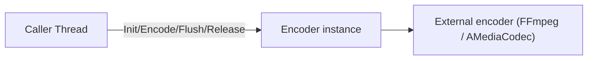
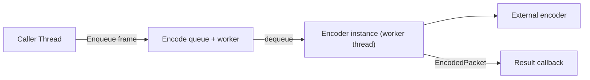

# Threading Model

## Default: synchronous, caller-owns-the-thread

An `Encoder` instance processes `Init` / `Encode` / `Flush` / `Release` on the calling
thread and returns when the operation is done. There is no internal worker thread and no
internal queue — the external encoder (FFmpeg `AVCodecContext`, NDK `AMediaCodec`) runs
synchronously from the caller's perspective.

## Instance thread-safety

A single `Encoder` instance is **not** internally thread-safe:

- Concurrent calls on the same instance are undefined behavior.
- The caller serializes, or owns **one instance per thread**.

Different instances are independent and may run on different threads concurrently.

## Optional async wrapper

Higher-level code MAY wrap an encoder in an async facade (encode queue + worker thread)
to keep the caller's media pipeline non-blocking:

The wrapper owns the instance and serializes all calls to it on the worker thread; this
preserves the "one instance, one thread" rule. The framework does not provide this
wrapper in the base design — it is a consumer/utility concern.

## Surface / NativeBuffer paths

- Android `InputSurface` may be drawn to from the caller's render thread; the backend
  serializes against its encode thread internally (per `nativebuffer-contract.md`).
- `Encode(NativeBuffer)` expects `handle` to stay valid only for the call's duration; no
  cross-thread ownership is taken.
