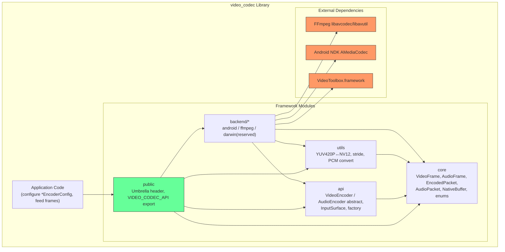
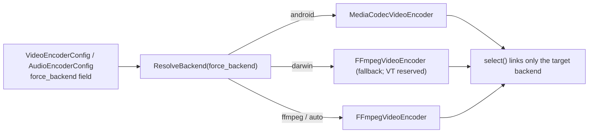
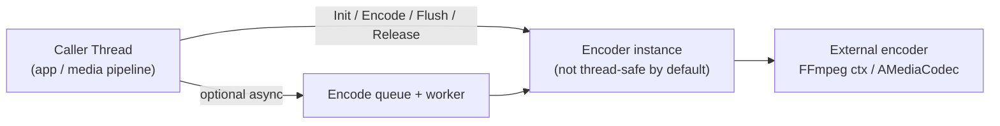
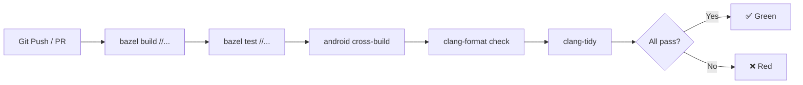
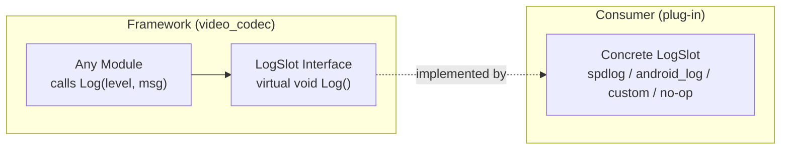

# Implementation Plan: Architecture & Engineering Design

**Branch**: `002-architecture-engineering-design` | **Date**: 2026-08-12 | **Spec**: [spec.md](spec.md)

**Input**: Feature specification from `specs/002-architecture-engineering-design/spec.md`

## Summary

Design and document the complete architecture of the video_codec framework — module
boundaries and visibility, the public `VideoEncoder` / `AudioEncoder` interface
contracts, the encoder lifecycle state machine, the platform backend-selection model,
the threading model, the uniform error-handling strategy, and a pluggable `LogSlot`
logging interface. Deliver architecture decision records (ADRs), API contracts,
engineering standards, CI/CD pipeline, release process, and spec-kit templates. This
phase produces **design artifacts only** — no runtime `src/framework/*.cc` code.

## Technical Context

**Language/Version**: C++17 (as established in `001-project-scaffold`)

**Build System**: Bazel 6.5.0

**Primary Dependencies**: FFmpeg 6.1 (`libavcodec`/`libavutil`, built from source via
`rules_foreign_cc` `configure_make`), `libx264` (encoder, currently dev-host Homebrew,
to be hermeticized per `research.md`), Android NDK (`AMediaCodec`, via
`android_ndk_repository`), googletest (testing), bazel_skylib (build helpers)

**Storage**: N/A (library project, no persistent storage)

**Testing**: googletest — unit tests (core / utils), integration / smoke tests
(backends, reuse the existing spikes), golden bitstream checks via `ffprobe`

**Target Platform**: macOS ARM64 (development), Linux x86_64 (CI/release),
Android arm64 (MediaCodec backend, cross-build)

**Project Type**: C++ static/shared library with a public C++ API (umbrella header +
`VIDEO_CODEC_API` export macro)

**Performance Goals**: Synchronous encode call returns within encode-time budget;
no surprise allocations on the hot `Encode()` path; zero-copy Surface input avoids CPU
readback for Android MediaCodec.

**Constraints**: FFmpeg must be linked as a **static, force-loaded** archive (the
`_ff_prefetch_aarch64` / NEON symbol must not be lazily dropped — see ADR-001); backends
are selected at link time via `select()` so a non-Android build never pulls the NDK and
a non-desktop build never pulls FFmpeg unless chosen; C++17 only; macOS `ld64` requires
BSD-format archives (the `libtool -static` merge in `third_party/ffmpeg/BUILD.bazel`).

**Scale/Scope**: Single library with 6 internal modules (core, api, backend/android,
backend/ffmpeg, backend/darwin [reserved], utils) + public umbrella + examples + tests
+ spikes.

## Constitution Check

*GATE: Must pass before Phase 0 research. Re-check after Phase 1 design.*

Constitution file (`.specify/memory/constitution.md`) contains placeholder template
content only — no project-specific principles, constraints, or gates have been defined.

- **Gate 1 — Project principles**: No binding principles defined. PASS.
- **Gate 2 — Constraints**: No binding constraints defined. PASS.
- **Gate 3 — Governance**: No governance rules defined. PASS.

**Verdict**: All gates pass. Constitution is a template awaiting project-specific content.

## Project Structure

### Documentation (this feature)

```text
specs/002-architecture-engineering-design/
├── spec.md              # Feature specification
├── plan.md              # This file
├── research.md          # Phase 0 research output
├── data-model.md        # Phase 1 data/entity model
├── quickstart.md        # Phase 1 developer quickstart
├── contracts/           # Phase 1 interface contracts
│   ├── public-api.md    # Public API surface contract
│   ├── encoder-contract.md
│   ├── backend-contract.md
│   └── nativebuffer-contract.md
└── tasks.md             # Phase 2 task breakdown (created by /speckit.tasks)
```

### Source deliverables

```text
codec/doc/architecture/
├── README.md                    # Architecture overview, key decisions index
├── module-dependencies.md       # Formal module dependency graph + visibility rules
├── error-handling.md            # StatusCode / Result<T> propagation strategy
├── lifecycle-model.md           # Encoder lifecycle state machine
├── backend-selection.md         # Factory + select() + force_backend model
└── logging-slot.md              # LogSlot abstract interface, plug-in by consumer

codec/doc/
├── build-conventions.md         # BUILD file conventions, dep prefix rules, visibility
├── testing-strategy.md          # Unit / integration / smoke test structure
├── ci-strategy.md               # CI matrix doc (macOS / Linux / Android)
└── release-process.md           # Versioning, publishing the Bazel library

codec/doc/adrs/
├── ADR-001-ffmpeg-static-forceload.md
├── ADR-002-select-per-platform-backend.md
├── ADR-003-bsd-libtool-merge.md
└── ADR-004-deferred-videotoolbox.md

.github/workflows/
├── ci.yml                       # CI: bazel build + test on macOS ARM64 / Linux x86_64
├── android.yml                  # Android cross-build (mediacodec_spike)
└── release.yml                  # Release: tag → build → publish

spec/video_codec/
└── _template.yaml               # spec-kit YAML template

CHANGELOG.md                     # Placeholder, populated on each release
```

**Structure Decision**: Architecture documents live under `codec/doc/architecture/`
to keep them separate from engineering standards (`codec/doc/` root) and API contracts
(`specs/002-.../contracts/`). ADRs get their own `codec/doc/adrs/` directory so each
load-bearing decision is independently referenceable. CI configs follow GitHub Actions
convention under `.github/workflows/`. Spec-kit templates live alongside other spec files
under `spec/video_codec/`.

## Architecture Overview (Phase 2 Deliverable)

### Module Architecture



**Dependency rule**: arrows point inward only (`public` → `api`/`core`/`utils`/`backend`;
backends depend on `api`/`core`/`utils` + their external dep; backends NEVER depend on
each other; `core` depends on nothing). Full visibility matrix in
`codec/doc/architecture/module-dependencies.md`.

### Encoder Lifecycle

```mermaid
stateDiagram-v2
    [*] --> Created: VideoEncoder::Create()
    Created --> Initialized: Init()
    Initialized --> Encoding: Encode() succeeds
    Encoding --> Encoding: Encode() more frames
    Encoding --> Initialized: error → Reset/Release
    Initialized --> Flushed: Flush()
    Flushed --> Initialized: Init() again (reuse)
    Flushed --> [*]: Release()
    Encoding --> [*]: Release()
    Created --> [*]: Release()
    Initialized --> [*]: Release()
```

Invalid transitions (e.g. `Encode` before `Init`) return a `StatusCode` error and do
not mutate state. Full model in `codec/doc/architecture/lifecycle-model.md`.

### Backend Selection



Compile-time `select()` ensures the chosen backend (and only it, plus its external dep)
is linked. `force_backend` overrides platform default for debug/test. Full model in
`codec/doc/architecture/backend-selection.md`.

### Threading Model



Default: synchronous, caller-owns-the-thread. An optional async wrapper (encode queue +
worker) is allowed but each `Encoder` instance is not internally thread-safe — callers
serialize or give one instance per thread. Full model in
`codec/doc/architecture/threading.md`.

### CI Pipeline



Matrix: macOS ARM64 + Linux x86_64 run `build`/`test`/`format`/`lint`; Android runs the
cross-build. Full strategy in `codec/doc/ci-strategy.md`.

### Logging Slot Interface



Framework logs through a `LogSlot` abstract interface; default is a no-op so there is no
hard logging dependency. Consumers plug a concrete impl. Full design in
`codec/doc/architecture/logging-slot.md`.

## Complexity Tracking

N/A — No constitution violations to justify.
